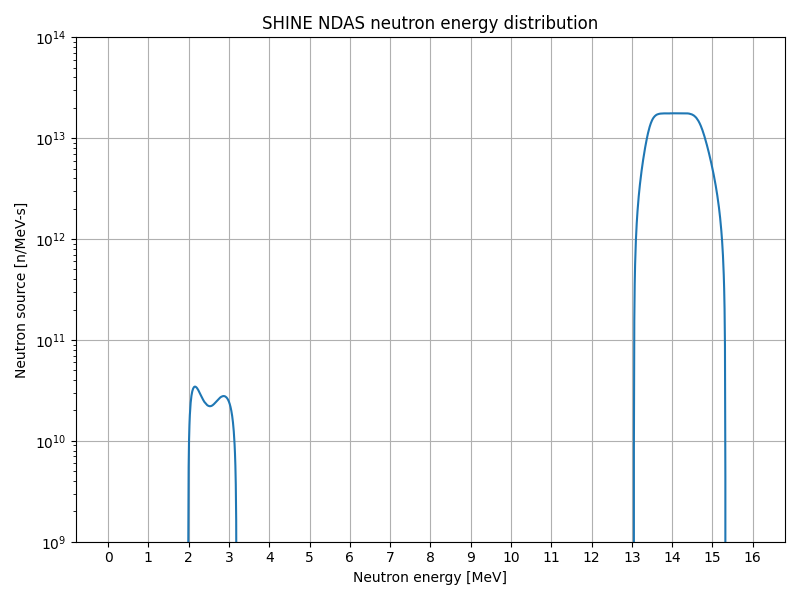

# SHINE-Source-Terms
This repository contains Monte Carlo neutron source terms and simplified geometries for SHINE's NDASes (neutron driver assembly systems).
Files for both MCNP and OpenMC are provided.

## System overview
The NDAS has two main sections: the accelerator section (not included in this repository) and the target chamber.
The purpose of the accelerator section is to create an intense ~300 keV beam of deuterons and guide them towards the target chamber.
The system is oriented vertically, such that the neutrons are produced at the top of the system and travel downwards until they reach the target chamber.
The target chamber, which contains tritium gas, is where the neutrons are produced.

## Geometry
The target chamber is cylindrical and has a double-layered stainless steel wall with cooling water in between.
It is 137 cm long, has an inner diameter of 8.3566 cm, and has an outer diameter of 9.652 cm.

Here are top-down and side views:

 

## Neutron source term

### Vertical distribution
When the deuteron beam enters the target chamber, some of the deuterons fuse with the tritium gas, creating ~14 MeV neutrons via the DT fusion reaction.
As the deuteron beam travels through the target chamber, it loses energy due to interactions with electrons in the gas.
Since the DT fusion cross section varies with the energy of the deuterons, having a peak around 110 keV, the neutron yield varies throughout the target chamber.
The peak neutron production rate occurs about 60% of the way down the target chamber.

### Radial distribution
The beam of deuterons enters the target chamber with a diameter of 0.4 cm.
As it travels through the target chamber, it spreads out with a divergence of 36 mrad.
By the time it has reached the bottom of the target chamber, the beam has diverged enough that some of it has impacted the wall.
(This has a minimal effect on the total neutron yield of the system.)

The effect of the beam divergence is only implemented in MCNP.
In OpenMC, an average beam diameter of 5.0526 cm is used instead.

### Angular distribution
The DT fusion cross section is nearly isotropic.
In the NDAS, just 14% more neutrons are emitted in the forward (downward) direction than the backward (upward) direction.
In these models, the same angular distribution is used for the entire neutron source term.

### Energy distribution
Neutrons produced in the forward (downward) direction have higher energies than those produced in the backward (upward) direction.
Also, neutrons produced earlier (higher up) in the target chamber have a larger range of possible energies than neutrons produced later (further down) because the deuteron beam has more energy when it first enters the target chamber.

Unfortunately, it was not possible to include both of these effects in the Monte Carlo source terms provided in this repository because MCNP limits users to a single distribution dependency.
For example, it is possible to have energy dependent on angle, and it is possible to have energy dependent on position, but it is not possible to have energy dependent on angle which is itself dependent on position.

Thus, the spatial dependence of the energy distribution was not included.
The energy distribution was made to be solely dependent on angle.

In OpenMC, the energy distribution was made independent as well.

Zooming out on the energy scale shows the small (~0.1%) contribution from DD fusion.
The target chamber nominally contains 90% tritium gas and 10% deuterium gas, and it is this small quantity of deuterium that accounts for the DD fusion reactions.

 

## MCNP and OpenMC results

### Tally energy spectrum
An annular tally cell with a 5 cm height and 0.254 cm thickness centered at a height 54 cm above the bottom of the target chamber was included in the models.
A track-length cell tally was added along with energy bins with CCFE-709 group structure.
The neutron energy spectra calculated by MCNP and OpenMC show good agreement.

### Neutron flux map
A cylindrical neutron flux mesh tally was also included.
The results from MCNP and OpenMC also show good agreement here.

 

